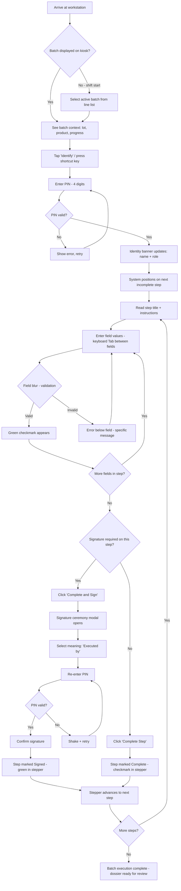
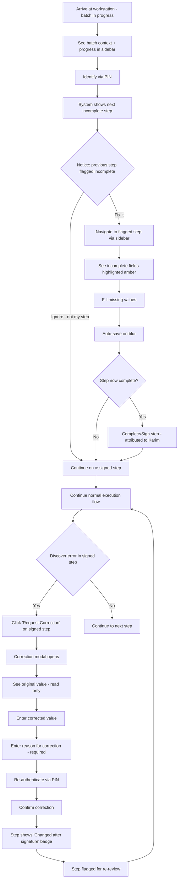
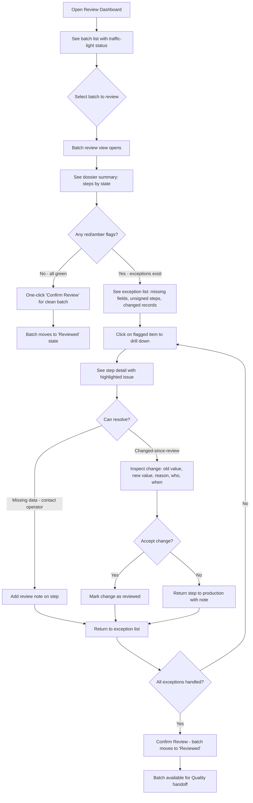
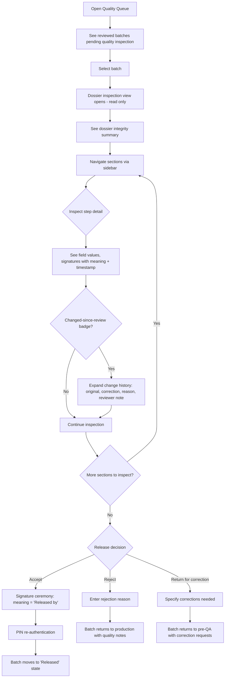
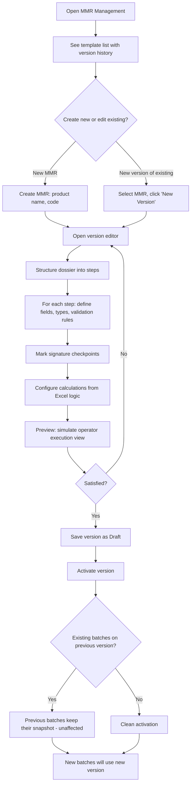

# UX Design Specification DLE-SaaS

**Author:** Axel
**Date:** 2026-03-07

---

<!-- UX design content will be appended sequentially through collaborative workflow steps -->

## Executive Summary

### Project Vision

DLE-SaaS is a lightweight electronic batch record platform for cosmetics manufacturing, designed to replace paper-based dossier de lot workflows with guided digital execution, structured review, and audit-ready traceability. The product targets ISO 22716-aligned environments that need pharma-like documentary rigor without the deployment weight of a full MES.

The core product insight is that the highest-value problem is documentary reliability, not simple digitization. Users need a system that makes missing entries, missing signatures, review gaps, and late corrections visible and manageable before dossier handoff to quality. The current paper process generates frequent documentary deviations (derogations) that have become routine rather than exceptional — the product must reduce their occurrence at the source through guided execution and early validation.

The first product slice targets one real client, one site, one representative template (fabrication + conditionnement), on shared line workstations (one PC per production line).

### Target Users

**Line Operator** — Executes batch record steps on a shared workstation during production shifts. Needs speed, clarity, and confidence that their part of the dossier is complete. Low tech proficiency; the tool must be faster and clearer than paper. Uses a fixed desktop PC on the production line, shared across up to three shift teams in 3x8 rotation.

**Late-Joining Operator** — Resumes work on a batch started by another operator, potentially from a different shift. Needs immediate visibility into current dossier state and the ability to identify and continue from the correct step without ambiguity. This is not an edge case — it is the normal operating mode on multi-shift lines.

**Production Supervisor / Pre-QA Reviewer** — Reviews dossier completeness before quality handoff. Needs a review-by-exception view that highlights missing data, unsigned steps, and changed records. Does not want to re-read every line manually.

**Quality Reviewer** — Inspects document integrity, signatures, corrections, and review history. Needs trust in what is presented without reconstructing context from raw audit logs. Makes accept, reject, or return-for-correction decisions.

**Internal Configurator** — Creates and versions MMR templates, activates versions, and governs template lifecycle. Needs controlled administration that preserves trust in live execution records.

### Key Design Challenges

- **Operator speed vs. documentary rigor**: The execution interface must be faster and clearer than paper for the core workflow, or adoption fails regardless of compliance improvements. Every unnecessary screen, click, or confirmation is an adoption risk. The client explicitly expects a tool that is "pas trop complexe" and can be adopted "en douceur, petit a petit."
- **Shared workstation with user rotation**: Multiple operators use one PC per line across 3x8 shifts. The batch record stays open on the workstation; the user identity changes. Authentication, session continuity, and user attribution must be fluid. Re-authentication for signatures must be a micro-flow (2-3 seconds maximum) integrated inline, not a full login sequence.
- **Three distinct UX surfaces with different mental models**: Operators need a "doing" interface optimized for speed and step completion. Supervisors need a "checking" interface optimized for exception-based review. Quality reviewers need a "trusting" interface optimized for integrity inspection.
- **Safe and dignified correction handling**: The current process handles documentary gaps through routine derogations. Corrections in the digital system must feel like a normal, controlled workflow path — not an error mode. The system must make correction safe and visible rather than stressful.
- **Batch lot kiosk pattern**: The workstation default screen should always show the current active batch and its state. An arriving operator must see where things stand immediately and resume after quick identification, without navigating to find the lot.

### Design Opportunities

- **Contextual step guidance**: Unlike paper, the system can show only what is relevant to the current step, hide completed context, and guide the operator toward completion with real-time validation feedback. This is the primary lever for improving first-pass-right documentation rates.
- **Review by exception**: The pre-QA and quality review surfaces can surface only what needs attention — missing fields, unsigned steps, changed-since-review records, unresolved issues. This is the safety net that catches what execution missed, and the highest time-saving capability versus current paper process.
- **Visible trust and integrity**: Rather than burying traceability in technical audit logs, the product can make documentary trust visual: clear step states, contextual signatures with meaning and timestamps, readable change history, and explicit review states. This is the commercial differentiator against generic tools.
- **Demo credibility moments**: The first demonstration must answer three explicit client questions unambiguously: (1) this is a real software product, not a macro, (2) electronic signatures work in an operator context, (3) Excel-derived calculations are integrated and verifiable. The UX must make each of these self-evident.

## Core User Experience

### Defining Experience

The core interaction is a line operator completing a batch record step on a shared workstation. This is the most frequent action and the one that determines downstream quality: if steps are filled correctly during execution, pre-QA review becomes exception-based rather than exhaustive, derogations decrease, and first-pass-right rates improve.

The operator core loop is: see the current step, enter the required data, validate, sign if required, move to the next step. This cycle must be faster and clearer than filling the same information on paper.

### Platform Strategy

- **Platform**: Web application for desktop browsers on fixed production line workstations
- **Input**: Keyboard and mouse primary; no touch optimization required in v1
- **Screen targets**: Minimum 1280x800, standard 1920x1080
- **Connectivity**: Stable connection confirmed; no offline mode in v1
- **Mobile**: Not in scope for v1
- **Browser**: Standard modern desktop browsers

### Effortless Interactions

- **Batch state visibility on arrival**: The workstation screen always shows the current active batch and its progress state. An arriving operator sees where things stand without navigation (lot kiosk pattern).
- **Micro-authentication for user switching**: Quick re-identification (PIN or equivalent, 2-3 seconds) integrated inline, not a full login. The batch stays on screen; only the user identity changes.
- **Keyboard-driven data entry**: Tab between fields, Enter to confirm, immediate validation feedback. The data entry flow must match or exceed the speed of writing on paper.
- **Mandatory field clarity**: Required fields, optional fields, and validation errors are instantly distinguishable without reading labels or instructions.
- **Progressive save**: Step data saves automatically as the operator works. No explicit save action required. No data loss on session interruption.

### Critical Success Moments

1. **"Faster than paper"** — The operator realizes within the first 5 minutes that completing a step digitally is more fluid than filling a paper form. If this moment does not occur, adoption is at risk regardless of compliance benefits.
2. **"I know it's complete"** — The production supervisor sees at a glance that the dossier is ready for quality handoff without re-reading every line. Missing fields, unsigned steps, and changed records are surfaced by exception.
3. **"I can trust what I see"** — The quality reviewer sees signatures, corrections, and review states presented clearly without reconstructing context from raw audit data. Document integrity is visual, not inferred.
4. **"The signature is serious"** — During the client demonstration, the signature flow visibly includes re-authentication, signer identity, server timestamp, and signature meaning. This directly answers the client's explicit question about how electronic signatures work for operators.

### Experience Principles

1. **Step-first, not document-first** — The operator never sees "the entire dossier." They see the current step, what must be done, and what is missing. The complete dossier is a review view, not an execution view.
2. **The lot stays, the user changes** — The line workstation is a kiosk centered on the active batch. The operator identity is an overlay on the persistent batch context, not the entry point to the application.
3. **Validation at the source, not at review** — The system catches errors and omissions during execution, not after. Review should handle exceptions, not basic oversights.
4. **Correction is a workflow, not a failure** — Post-signature and post-review corrections follow a normal, traceable workflow path. The UX treats correction as a dignified process, not an error mode.
5. **Trust is visual** — Confidence states (signed, reviewed, changed-since-review, incomplete) are always visible in the interface, never buried in logs. Users should never have to infer document integrity.

## Desired Emotional Response

### Primary Emotional Goals

The primary emotional target is **operational serenity** — the feeling that things are under control, work is progressing without doubt, and the dossier is reliable. DLE-SaaS is not aiming for excitement or surprise. It is aiming for the calm confidence of a professional tool that does exactly what it promises without creating uncertainty.

### Emotional Journey Mapping

**Operator emotional journey:**
- Arrival at workstation: Immediate clarity — "I know where we are, I know what to do." No confusion, no searching.
- During data entry: Flow and rhythm — "Things are moving, it's fluid, I'm not blocked." Like writing with a pen but with a safety net.
- At signature checkpoint: Controlled gravity — "What I'm signing is clear and serious, but not stressful." Signature is a moment of confirmation, not anxiety.
- During correction: Safety — "I can fix this without breaking the dossier. The system guides me." No panic, no shame.

**Production supervisor emotional journey:**
- Opening review: Relief — "I can see immediately what's wrong without re-reading everything."
- During review: Mastery — "I have control over what I pass to quality."
- After review: Confidence — "This dossier is ready."

**Quality reviewer emotional journey:**
- At inspection: Trust — "I can rely on what the interface shows me."
- Facing corrections: Transparency — "I see what changed, when, and why, without digging."
- At release decision: Assurance — "I have enough information to decide."

### Micro-Emotions

**Critical micro-emotions to cultivate:**
- Confidence over confusion at every interaction point
- Trust over skepticism when viewing document states and signatures
- Accomplishment over frustration when completing steps
- Safety over anxiety when corrections are needed

**Emotions to actively prevent:**
- Distrust: "Did the system actually save?" — Addressed by visible progressive save confirmation
- Fear of breaking: "If I correct this, will it cause a problem?" — Addressed by guided correction workflow
- Cognitive overload: "Too much information on screen" — Addressed by step-first design
- Feeling surveilled: "The system is watching me" — Audit serves documentary quality, not operator surveillance
- Prototype impression: "This doesn't look serious" — Addressed by professional visual design with industrial sobriety

### Design Implications

| Target emotion | UX decision |
|---|---|
| Immediate clarity | Lot kiosk pattern with visible batch state on arrival |
| Flow and rhythm | Keyboard navigation, auto-save, inline validation feedback |
| Controlled gravity | Inline signature with quick re-auth, no alarming modal popups |
| Safety in correction | Explicit correction path with reason capture, no aggressive confirmation dialogs |
| Relief in review | Exception dashboard, not exhaustive line-by-line listing |
| Quality trust | Explicit visual states (signed, changed, incomplete) on every element |
| Professionalism | Sober typography, neutral industrial palette, controlled information density |

### Emotional Design Principles

1. **Calm over clever** — Every interaction should feel predictable and controlled. No surprises, no unnecessary animations, no playful elements that undermine professional credibility.
2. **Progress over perfection** — The system should constantly communicate forward movement. Step completion indicators, save confirmations, and status transitions reinforce that work is advancing.
3. **Safety net, not surveillance** — Validation, audit trails, and review states exist to protect document quality, not to monitor operators. The UX must frame compliance features as helpful guardrails, not oversight tools.
4. **Gravity without anxiety** — Signatures and review decisions are serious moments, but the design should make them feel controlled and clear, not stressful or punitive.
5. **Professional credibility at first glance** — The visual design must immediately communicate "real software product" to address the client's explicit concern about whether this is a macro or a real application.

## UX Pattern Analysis & Inspiration

### Inspiring Products Analysis

**MasterControl Manufacturing Excellence** — Market leader in electronic batch records. Strong on compliance automation and review-by-exception. User reviews from 2025-2026 consistently report that the operator interface is slow and difficult compared to paper, with UI elements placed too close together and complex navigation. Key lesson: compliance without operator speed leads to adoption failure. DLE-SaaS must invert this — fast first, rigorous by design.

**BatchLine MES** — Positions as "modern app UX" for GMP manufacturing. Notable patterns include collaborative exception review between supervisors and QA, dual-view PDF reports (latest view vs. full history), and calculation references to previous EBR values. Key lesson: review collaboration and PDF output become real product areas quickly and should not be treated as afterthoughts.

**Tulip Connected Worker Platform** — Leading frontline operations platform with guided, media-rich, multilingual workflows. Design philosophy centers on human factors: operators may wear gloves, work under time pressure, and need minimal interaction paths. Explicit separation between execution apps and review apps. Key lesson: factory-floor UX tolerates zero unnecessary complexity. Every interaction must be minimal and purposeful.

**OpenClinica** — Clinical form system with exemplary versioning discipline. Published forms cannot be edited, only versioned. Verified data that is edited later moves to a visible "changed since verified" state. Re-review is explicit after changes. Key lesson: the "changed-since-review" pattern is proven in a highly regulated context and directly transferable to batch record review.

### Transferable UX Patterns

**Step-based wizard with horizontal stepper**: Execution UI uses a horizontal stepper showing all batch steps, current position, and completion state. Each step is a focused screen with only relevant fields (maximum 5-9 fields per step). Single-column layout for faster scanning. Allow clicking completed steps to jump back without losing data. Proven in enterprise form patterns (PatternFly, NNGroup) and manufacturing platforms (Tulip).

**Keyboard-first data entry**: Tab between fields, Enter to confirm, immediate inline validation. Every field must be triggerable and editable using only the keyboard. Auto-advance focus after known-length fields are completed (e.g., 8-digit lot number). Carry-forward defaults for repetitive entries. Power users should complete entire steps without touching the mouse.

**"Reward early, punish late" validation**: Validate on blur (when the user leaves the field), never on keystroke. Show green checkmarks as soon as a field passes validation. Show error states only after the user has completed their input attempt. Validate empty required fields only on step submission, not on blur of an untouched field. Error messages must be specific and actionable, positioned directly below the field with redundant coding (color + icon + text).

**Progressive auto-save with visual feedback**: Step data saves automatically on every field blur and at regular short intervals. A persistent status indicator shows "Saving..." or "Saved X sec ago." No explicit save button needed, but auto-save and manual save can coexist. On unexpected page close or crash, restore the last saved state on return. Distinguish between auto-saved drafts and intentionally submitted steps.

**Lot kiosk with fast user switching**: The workstation always shows the active batch. User switching happens via inline micro-authentication (PIN, badge tap, or equivalent — sub-3-second target). A permanent identity banner shows the current user's name and role at all times, preventing accidental work under another person's identity. Session lock on inactivity with countdown warning. Session preservation on lock (applications remain running behind the lock screen).

**Review-by-exception dashboard**: The system automatically flags components that do not meet pre-specified standards. Clean items are collapsed or presented as "reviewed — no exceptions found" for one-click confirmation. Reviewers focus only on flagged items. Dashboard uses traffic-light summary: green (auto-passed), yellow (needs review), red (failed/blocked). Supports bulk approval for clean batches. Progressive disclosure: essential information at first glance, expandable detail on demand.

**Visible "changed-since-review" state**: Any record modified after review or signature displays a visual badge with redundant coding (color + shape + text). Reviewers can immediately identify what needs re-review without comparing versions manually. Directly adapted from OpenClinica's verified-data model.

**Signature ceremony with meaning capture**: Signing flow follows a focused modal pattern: record summary showing what is being signed, explicit meaning selection (dropdown: "Reviewed" / "Approved" / "Verified"), re-authentication (PIN or password inline, not a redirect), and confirmation. After signing, a persistent signature manifest block displays name, role, meaning, and timestamp on the record. The ceremony must feel deliberate and serious without being slow — target sub-3-second re-authentication.

**ISA-101 inspired color strategy**: Neutral/gray background as baseline during normal operations. Color appears only when attention is needed. Reserve red for critical alerts, orange for warnings, green for confirmed/signed states. Never use alarm colors for decorative or status-normal purposes. All critical information uses redundant coding (color + shape + text) for accessibility and readability under varying lighting conditions.

### Anti-Patterns to Avoid

**Monolithic document view for operators**: Showing the entire dossier as a scrollable form creates cognitive overload. Always break execution into discrete steps. MasterControl user complaints confirm this is a real adoption risk.

**Cramped UI elements**: UI elements placed too close together cause misclicks in production environments. Generous spacing, clear touch/click targets, and visual separation between interactive elements are essential.

**Keystroke validation**: Validating while the user is still typing causes constant error flashing and frustration. Validate on blur only. Never validate untouched empty fields.

**Signature as UI widget only**: A canvas signature pad or simple checkbox has no regulatory value. Signatures must be business events with re-authentication, signer identity, server timestamp, meaning selection, and signed-state reference.

**Hidden audit trail**: Change history that exists only in technical logs is operationally useless for reviewers. Changed-since-review and changed-since-signature states must be visible in the workflow UI, not inferred from audit data.

**Generic form builder semantics**: Treating the system as a generic form engine loses batch-record business semantics (lot, signature, review event, release state). Explicit domain objects are essential for credibility and correctness.

**Silent auto-save**: Auto-saving without visual feedback creates user distrust. Always confirm save status with a visible indicator.

**Aggressive confirmation modals**: Modal confirmation dialogs for routine actions slow operators and create friction. Reserve modals for truly irreversible actions (signature, dossier submission, release decision).

**Color-only coding**: Never rely on color alone for critical information. Always combine color + shape + text for accessibility, color vision deficiencies, and varying factory lighting conditions.

**Mouse-dependent interactions in keyboard-first flows**: Dropdowns requiring clicks, buttons not reachable by Tab, or field selection requiring mouse — all break the keyboard-first rhythm and slow down data entry.

### Design Inspiration Strategy

**Adopt directly:**
- Horizontal stepper pattern for step-based operator execution (PatternFly model)
- Auto-save with timestamp feedback (GitLab Pajamas model)
- "Changed-since-review" visual badge (OpenClinica model)
- Exception dashboard with traffic-light summary for review surfaces
- "Reward early, punish late" validation strategy (NNGroup)
- Signature ceremony with meaning capture (21 CFR Part 11 patterns)
- Permanent user identity banner on shared workstations

**Adapt to context:**
- ISA-101 neutral-background color strategy adapted for web application rather than HMI panel
- Healthcare fast-user-switching (Imprivata) adapted to inline micro-authentication for operator signatures via PIN
- Enterprise wizard patterns adapted for batch record step execution (not onboarding)
- Tulip guided workflows simplified for dossier steps without IoT/scanner components
- Carry-forward defaults for repetitive batch data entry across similar steps

**Deliberately avoid:**
- MasterControl's heavy-suite approach — stay lightweight and fast
- Generic form builder semantics — maintain explicit batch record domain objects
- Complex offline mode — stable connectivity confirmed by client
- Consumer-style gamification or delight animations — maintain professional industrial sobriety
- Keystroke validation — use blur-based validation only

## Design System Foundation

### Design System Choice

**Selected system: shadcn/ui + Tailwind CSS** (built on Radix UI primitives)

shadcn/ui is a collection of accessible, customizable React components that are copied into the project rather than imported as a dependency. Components are built on Radix UI primitives, which provide native keyboard navigation, ARIA compliance, and focus management. Tailwind CSS provides utility-first styling for rapid customization.

### Rationale for Selection

1. **Keyboard-first accessibility**: Radix UI primitives provide native Tab, Enter, Escape, and Arrow key navigation out of the box. Critical for keyboard-driven data entry in production environments.
2. **Neutral professional aesthetic**: Default shadcn/ui rendering is sober and professional without strong design opinions. Ideal as a foundation for an ISA-101 inspired neutral industrial palette.
3. **Full component ownership**: Components are copied into the project, not imported from a package. Custom batch-record components (step executor, signature ceremony, review dashboard) can be built and modified freely without library constraints.
4. **Development speed**: Tailwind CSS utility classes enable rapid styling without writing custom CSS. Combined with shadcn/ui's ready-made component patterns, a solo developer can achieve professional results quickly.
5. **Component coverage**: Form, Dialog, Table, Badge, Alert, Toast, Tabs, and composition patterns for steppers and wizards cover all identified UX patterns.
6. **Immediate credibility**: The default visual treatment communicates "real software product" rather than prototype, directly addressing the client's concern.

### Implementation Approach

- Initialize shadcn/ui via CLI and select required components incrementally
- Define DLE-SaaS design tokens: neutral industrial color palette (gray baseline, color only for attention states), sober typography, generous spacing for production workstation usage
- Install primitives into `frontend/src/shared/ui/` so the design system follows the canonical `app/shared/features` frontend structure from the architecture artifact
- Build domain-specific composite components on top of shadcn/ui primitives:
  - `StepExecutor` — Horizontal stepper with step-based form rendering
  - `SignatureCeremony` — Focused modal with meaning selection and inline re-authentication
  - `ReviewDashboard` — Exception-based review surface with traffic-light summary
  - `IdentityBanner` — Persistent user identity display with lock/switch controls
  - `SaveIndicator` — Progressive save status with timestamp feedback
- Target screen resolutions: minimum 1280x800, standard 1920x1080
- Validate all interactive components for keyboard-only operation

### Customization Strategy

**Design tokens to define:**
- Color palette: Neutral gray baseline (#f5f5f5 background, #1a1a1a text), with semantic colors reserved for states — green (signed/complete), amber (needs attention/review), red (blocked/error), blue (information/in-progress)
- Typography: System font stack for maximum rendering speed and reliability on production workstations, with clear size hierarchy (14px body, 16px field labels, 20px step titles, 24px page headers)
- Spacing: Generous padding and margins (minimum 12px between interactive elements) to prevent misclicks in production environments
- Border radius: Minimal (4px) for professional, industrial appearance
- Shadows: Subtle, functional only (elevation for modals and dropdowns, not decorative)

**Component customization priorities:**
- Form inputs: Larger touch/click targets, clear focus rings, inline validation styling
- Stepper: Custom horizontal stepper matching batch record step semantics (not started, in progress, completed, signed, flagged)
- Badges: Redundant coding (color + icon + text) for all status indicators
- Dialogs: Signature ceremony modal with distinct visual treatment from standard dialogs

## Defining Core Experience

### Defining Experience

The defining experience of DLE-SaaS is: **"Complete a batch record step and know it is done, done right, and proven."**

What differentiates DLE-SaaS from paper is not digitization — it is certainty. On paper, no one knows whether the dossier is complete until someone re-reads the entire document. With DLE-SaaS, every completed step is an acquired certainty: the data is present, validation has passed, the signature is traced, and the next operator can continue without doubt.

The product's equivalent of "swipe to match" is the moment the operator completes a step, sees the stepper advance, and knows that step is now review-ready — no second-guessing, no informal colleague verification, no hoping the supervisor will catch the gap.

### User Mental Model

**Current paper workflow mental model:**
- Operators fill in boxes, sometimes forget entries, are not sure whether the dossier is complete
- Supervisors re-read the entire dossier line-by-line to find gaps — tedious and often skipped ("we don't do that pre-QA review" — client)
- Quality receives incomplete dossiers and manages gaps through routine derogations
- No real-time feedback; completeness is discovered late, not ensured early

**Current workarounds:**
- Systematic derogations as a safety net for documentary gaps
- Exhaustive re-reading (when it happens) as a substitute for real-time validation
- Informal peer checks between colleagues ("did you fill in page 3?")

**Expected digital mental model:**
- The system eliminates doubt — it does not add screens
- Completing a step means it is confirmed complete, not just "filled in"
- The dossier progresses visibly toward a known-good state
- Review is fast because the system already caught the basics

### Success Criteria

1. An operator can complete a representative batch step faster than filling the equivalent paper section, measured by task completion time in usability testing
2. After completing a step, the operator has zero uncertainty about whether their work is recorded and complete
3. A production supervisor can identify all incomplete or attention-requiring elements in a batch dossier within 30 seconds using the review dashboard
4. The signature ceremony takes less than 5 seconds from initiation to confirmation (including re-authentication)
5. A returning operator on a shared workstation can identify the current dossier state and resume work within 10 seconds of arriving at the station

### Novel UX Patterns

The core experience uses **established patterns in a domain-specific combination**, not radical UX innovation:
- Step-based wizard/stepper — proven enterprise pattern, adapted for batch record steps
- Progressive auto-save — proven pattern (Google Docs, GitLab), adapted for step-level granularity
- Shared workstation kiosk — proven pattern (healthcare, manufacturing), adapted for batch lot context
- Signature as business event — proven regulated pattern (21 CFR Part 11, OpenClinica), adapted for cosmetics manufacturing context

The innovation is in the **specific combination**: operator guidance + documentary certainty + exception-based review, delivered in a lightweight package. This is what heavy MES platforms do poorly and what paper cannot do at all.

### Experience Mechanics

**1. Initiation — Arrival at workstation:**
- The active batch and its progress state are visible on the kiosk screen
- The operator identifies via PIN (2-3 seconds)
- The system positions them automatically on the next step to complete
- No navigation, no search: "the work is waiting for you"

**2. Interaction — Step data entry:**
- The screen shows only the current step: title, instructions if needed, fields to fill
- Keyboard navigation (Tab/Enter) between fields
- Each field shows validation state immediately on blur (green checkmark for valid)
- Required empty fields do not show errors until step completion is attempted
- Continuous auto-save with visible "Saved" indicator and timestamp

**3. Feedback — Continuous confirmation:**
- Each validated field: discreet green checkmark
- Step completable: "Complete Step" button becomes active
- If signature required: button transforms to "Complete and Sign" triggering inline ceremony (meaning selection + PIN + confirmation)
- After completion: step moves to "completed" state in the stepper, next step opens automatically
- Key feedback: the dossier progress bar advances visibly

**4. Completion — Certainty acquired:**
- The operator sees in the stepper how many steps are done vs. remaining
- On leaving the workstation, the dossier remains displayed with its current state for the next operator
- The supervisor sees immediately that this step is completed and signed without re-reading it

## Visual Design Foundation

### Color System

**Strategy: ISA-101 inspired neutral baseline with semantic color accents**

The screen is calm during normal operations. Color appears only to communicate a state that requires attention. All semantic colors are accompanied by redundant coding (icon + text) for accessibility and readability under varying factory lighting conditions.

**Neutral palette:**
- Background primary: #F8F9FA (light gray — calm, restful application background)
- Background surface: #FFFFFF (white — cards, panels, active input areas)
- Background subtle: #F1F3F5 (light gray — stepper background, secondary zones)
- Text primary: #212529 (near-black — body text, field labels)
- Text secondary: #868E96 (medium gray — metadata, timestamps, hints)
- Borders: #DEE2E6 (light gray — separators, field borders)

**Semantic palette:**
- Completed/Signed: #2B8A3E (green — checkmarks, completed steps, confirmed signatures)
- Active/Info: #1971C2 (blue — active step, links, primary actions)
- Attention/Review: #E67700 (amber — changed-since-review, fields requiring verification)
- Error/Blocked: #C92A2A (red — failed validation, blocked steps)
- User Identity: #5C7CFA (indigo — identity badge in header, user accent)

**Color principles:**
- In normal operation, the screen is predominantly gray and white
- Color appears only to communicate states requiring attention
- All semantic colors use redundant coding (color + icon + text)
- Minimum contrast ratios: WCAG AA (4.5:1 for text, 3:1 for interactive elements)

### Typography System

**Primary typeface: Inter** (with system-ui, sans-serif fallback)

Inter is selected for its screen-optimized legibility, native tabular figures (critical for numeric data alignment in batch records), clear character disambiguation (1/l/I, 0/O), and open-source licensing.

**Type scale:**
- Page title: 24px / semibold (600) — batch name, section headers
- Step title: 20px / semibold (600) — active step title in stepper
- Body / field values: 16px / regular (400) — text in fields, instructions
- Field labels: 14px / medium (500) — labels above input fields
- Metadata: 13px / regular (400) — timestamps, save indicator, identity info
- Badge / status: 12px / semibold (600) — status badges (Signed, In Review, Changed)

**Typography principles:**
- Labels always above fields, never beside (faster scanning, accommodates longer labels)
- Tabular figures enabled for all numeric displays (lot numbers, measurements, dates)
- Line height: 1.5 for body text, 1.3 for headings, 1.2 for badges and compact elements

### Spacing & Layout Foundation

**Spacing scale (base unit: 4px):**
- xs: 4px (badge internal spacing, micro-gaps)
- sm: 8px (label-to-field spacing, light internal padding)
- md: 16px (between fields in a form)
- lg: 24px (between sections, card padding)
- xl: 32px (between major groups, page margins)
- 2xl: 48px (separation between surfaces)

**Layout structure:**
- Single-column layout for operator execution — one column of fields, no multi-column layouts that break vertical flow
- Content max-width: 720px centered — prevents overly long text lines
- Fixed sidebar stepper (240px) — always visible on the left, showing dossier progress
- Fixed identity banner at top (56px) — user name, role, lock/switch button
- Fixed save indicator in header or bottom bar — always visible

**Interactive target sizing:**
- Input fields: minimum height 44px (comfortable click target, accessible)
- Primary buttons: minimum height 44px, horizontal padding 24px
- Stepper elements: minimum click area 44x44px
- Minimum spacing between clickable elements: 12px

**Layout principles:**
- Generous spacing throughout — production environments require larger targets and clearer separation than typical office applications
- Visual grouping through whitespace and subtle containers, not heavy borders
- Information density controlled by progressive disclosure — show detail on demand, not by default

### Accessibility Considerations

**Visual accessibility:**
- All color-coded states use redundant coding: color + shape/icon + text label
- Minimum contrast ratio WCAG AA (4.5:1 text, 3:1 interactive elements) verified for all color combinations
- Focus rings clearly visible on all interactive elements (2px solid blue outline with 2px offset)
- No information conveyed through color alone

**Motor accessibility:**
- All critical actions executable by keyboard (Tab, Enter, Escape, Arrow keys)
- Touch/click targets minimum 44x44px
- Minimum 12px spacing between interactive elements to prevent misclicks
- No drag-and-drop required for any core workflow

**Cognitive accessibility:**
- Step-first design limits information visible at any time
- Consistent placement of navigation, actions, and feedback across all screens
- Clear, specific error messages with actionable guidance
- Progressive disclosure prevents cognitive overload

**Environmental accessibility:**
- High contrast palette readable under fluorescent factory lighting
- System font fallback ensures rendering on any workstation configuration
- No reliance on audio cues (noisy production environment)
- Generous sizing readable at standard desktop viewing distance (50-70cm)

## Design Direction Decisions

### Selected Layout Strategy

Based on collaborative evaluation of six design directions, the following combination was selected:

**Primary operator layout: Direction A — Sidebar Stepper**
- Fixed left sidebar (240px) showing all batch steps with completion states
- Active step content in centered main panel (max-width 720px)
- Fixed identity banner at top with user name, role, and lock/switch controls
- Lot kiosk pattern: batch context always visible in sidebar header
- Single-column field layout for optimal scanning speed

**Review surfaces:**
- Direction C (Review Dashboard) for pre-QA supervisor — exception-based traffic-light view with drill-down
- Direction F (Quality Review) for quality inspector — read-only dossier inspection with annotations and release controls

**Overlay flows:**
- Direction D (Signature Ceremony) — focused modal with meaning selection, PIN re-authentication, and confirmation
- Direction E (Correction Flow) — guided correction with original value display, new value entry, and reason capture

### Direction Rationale

The sidebar stepper was selected over the top stepper (Direction B) because:
- Vertical step list accommodates longer step names without truncation
- Sidebar provides persistent dossier progress visibility without consuming vertical space needed for form content
- Natural left-to-right reading flow: navigation on left, content on right
- Better adaptation to the minimum 1280x800 target resolution

All six directions share a cohesive visual language: ISA-101 neutral baseline, Inter typography, semantic color accents, and redundant coding for all status indicators.

### Browser Compatibility Requirements

**Minimum browser targets:**
- Chrome/Chromium 70+ (covers workstations with 6+ years of update lag)
- Firefox 68+ (ESR versions common in enterprise environments)
- Safari 12+ (if any Mac workstations exist)
- Edge 79+ (Chromium-based Edge)

**Implementation strategy:**
- `@vitejs/plugin-legacy` with `target: 'es2015'` for JavaScript transpilation and automatic polyfill injection
- Autoprefixer for CSS vendor prefixes (standard with Tailwind CSS PostCSS pipeline)
- CSS Grid and Flexbox as layout primitives (supported since 2017+ across all target browsers)
- HSL color values (universally supported)
- Avoid modern JS APIs (`structuredClone`, `Array.at()`, `Object.hasOwn()`) without polyfill
- Inter font with `system-ui, sans-serif` fallback for workstations that cannot load web fonts
- Test matrix: Chrome 70, Firefox 68, Safari 12 as minimum validation targets

**What this does NOT cover (and does not need to):**
- Internet Explorer 11 — confirmed not in scope (Windows 10+ with modern browsers)
- Mobile browsers — not in scope for v1 (desktop workstations only)

### Design Direction Reference

Interactive HTML mockups for all six directions are available at:
`_bmad-output/planning-artifacts/ux-design-directions.html`

## User Journey Flows

### Journey 1: Operator Executes a Batch Step (Nadia)

**Entry point:** Operator arrives at shared workstation — batch kiosk screen is already displayed.



**Key timings:**
- PIN identification: < 3 seconds
- Field entry + validation: real-time on blur
- Auto-save: on every field blur, visible "Saved Xs ago" indicator
- Signature ceremony: < 5 seconds total
- Step transition: immediate, no loading screen

### Journey 2: Late-Joining Operator Resumes and Corrects (Karim)

**Entry point:** Operator arrives mid-batch on a shared workstation where another operator started.



**Key UX decisions:**
- Late joiner sees full dossier state immediately — no briefing needed
- Sidebar stepper shows which steps are complete, signed, incomplete, or flagged
- Correction preserves original value alongside new value + reason
- Changed-since-signature badge is persistent and visible in review surfaces

### Journey 3: Supervisor Pre-QA Review (Sophie)

**Entry point:** Supervisor opens review dashboard — separate surface from operator execution.



**Key UX decisions:**
- Dashboard-first, not document-first — supervisor never re-reads the full dossier
- Traffic-light: green (auto-passed), amber (needs attention), red (blocked)
- Bulk approval for clean batches — one click, not step-by-step
- Drill-down to exception, not scroll-through to find it
- Review notes are persistent and visible to quality

### Journey 4: Quality Review and Release (Claire)

**Entry point:** Quality reviewer opens reviewed batch from quality queue.



**Key UX decisions:**
- Read-only dossier view — quality cannot edit, only inspect and decide
- Signature manifest on every signed step: name, role, meaning, timestamp
- Three decision paths: release, reject, return for correction
- Release itself is a signature ceremony (meaning = "Released by")
- Full traceability chain visible without raw audit log access

### Journey 5: Configurator Prepares Template (Axel)

**Entry point:** Admin interface — separate from production surfaces.



### Journey Patterns

**Navigation patterns:**
- **Sidebar-as-map**: The left sidebar serves as both navigation and progress indicator across all surfaces. Operators see steps, reviewers see sections, quality sees the full dossier structure.
- **Context-then-action**: Every surface shows context first (what batch, what state, what user) before presenting actions. No blind entry points.
- **Drill-down from dashboard**: Review surfaces start with a summary dashboard and allow progressive drill-down to specific issues. Never force linear traversal.

**Decision patterns:**
- **Binary-then-confirm**: Simple decisions (complete step, approve review) use a single action + confirmation. Complex decisions (correction, rejection) add a mandatory reason step.
- **Meaning-first signature**: Every signature starts with meaning selection before authentication, ensuring the signer understands what they are confirming.

**Feedback patterns:**
- **Immediate field validation**: Green checkmark on blur for valid fields. Error message below field for invalid. No validation on untouched fields.
- **Persistent save indicator**: "Saved Xs ago" always visible. No ambiguity about data persistence.
- **State badges everywhere**: Completed, Signed, Changed, Incomplete — visible as badges in steppers, dashboards, and review views with redundant coding (color + icon + text).

### Flow Optimization Principles

1. **Zero-navigation arrival**: Operators arrive and see the batch + their next task immediately. No menu traversal, no search, no dashboard-first.
2. **Keyboard-continuous entry**: Within a step, Tab moves between fields, Enter confirms, Escape cancels. Mouse is optional, never required.
3. **Exception-only review**: Reviewers interact only with flagged items. Clean items are auto-collapsed or bulk-approvable.
4. **Sub-5-second ceremonies**: Signature and re-authentication flows target under 5 seconds. No page redirects, no multi-step wizards for what is fundamentally a confirm-and-authenticate action.
5. **Graceful interruption**: Auto-save means any interruption (shift change, power issue, browser close) loses at most one field of data. Return to the same state on next session.

## Component Strategy

### Design System Components

**shadcn/ui components used directly:**

| Component | Usage in DLE-SaaS |
|---|---|
| `Input` | All text/number fields in step execution |
| `Label` | Field labels above inputs |
| `Button` | Complete Step, Sign, navigation actions |
| `Dialog` | Signature ceremony modal, correction modal |
| `Badge` | Status badges (Signed, Complete, Changed, Incomplete) |
| `Table` | Review dashboard batch list, field value tables |
| `Tabs` | Surface switching, section navigation |
| `Alert` | Validation summaries, system notifications |
| `Toast` | Save confirmation, transient feedback |
| `Select` | Dropdown fields, meaning selection in signature |
| `Checkbox` | Boolean fields in batch steps |
| `Textarea` | Reason for correction, review notes |
| `Separator` | Visual grouping within steps |
| `Tooltip` | Field hints, status explanations |
| `Card` | Step container, batch summary card |
| `ScrollArea` | Sidebar stepper when many steps |
| `Progress` | Dossier completion progress bar |
| `Collapsible` | Expandable sections in review views |
| `DropdownMenu` | Action menus (e.g., step actions for reviewer) |

**shadcn/ui components with minor customization:**

| Component | Customization needed |
|---|---|
| `Form` (react-hook-form integration) | Custom validation display with "reward early, punish late" pattern |
| `Sheet` | Side panel for step detail drill-down in review surfaces |
| `AlertDialog` | Adapted for irreversible action confirmations (release, reject) |

### Custom Components

#### StepSidebar

**Purpose:** Persistent left sidebar showing all batch steps with progress states. Primary navigation for operators and structural map for reviewers.
**Anatomy:**
- Batch context header (lot number, product name, batch state)
- Scrollable step list with state indicators
- Each step item: step number, title (truncated if needed), state icon+badge
- Active step highlighted with left border accent (blue)

**States per step:** Not Started (gray circle), In Progress (blue dot, pulsing), Complete (green checkmark), Signed (green lock icon), Incomplete (amber warning), Changed After Signature (amber badge with delta icon), Blocked (red X)
**Interaction:** Click step to navigate. Keyboard: Arrow Up/Down to move focus, Enter to select.
**Size:** Fixed 240px width. Collapses to icon-only (56px) on screens < 1280px.

#### IdentityBanner

**Purpose:** Fixed top bar showing current authenticated user. Always visible on shared workstations to prevent accidental work under wrong identity.
**Anatomy:**
- User avatar placeholder (initials circle, indigo background)
- User name + role text
- "Switch User" button (or shortcut hint)
- "Lock" button for stepping away
- Session timer (optional, for inactivity warning)

**States:** Identified (normal), Locked (overlay with PIN prompt), No User (prompt to identify)
**Interaction:** Click Switch or press keyboard shortcut to trigger PIN prompt. Lock triggers after configurable inactivity timeout.
**Size:** Full width, 56px height.

#### PinAuthDialog

**Purpose:** Inline micro-authentication for user switching and signature re-authentication. Must be sub-3-second flow.
**Anatomy:**
- Title ("Identify" or "Confirm Signature")
- 4-digit PIN input with auto-focus and masked display
- Auto-submit on 4th digit (no confirm button needed)
- Error state: shake animation + "Invalid PIN" + clear for retry

**States:** Waiting for input, Validating (brief spinner), Error (shake + message), Success (auto-close)
**Interaction:** Opens with keyboard focus on first digit. Digits auto-advance. Backspace to correct. Escape to cancel.
**Accessibility:** ARIA role="dialog", auto-focus management, screen reader announces prompt.

#### SignatureCeremony

**Purpose:** Focused modal for business-level signature with meaning selection and re-authentication. The core trust-building interaction.
**Anatomy:**
- Context summary: what is being signed (step title, batch reference)
- Meaning selector: dropdown with options ("Executed by", "Reviewed by", "Released by")
- PIN re-authentication (embeds PinAuthDialog)
- Confirm button (active only after meaning + valid PIN)
- Cancel button
- Post-signature: manifest block (name, role, meaning, timestamp) replaces the ceremony

**States:** Open (awaiting input), Meaning Selected, Authenticated, Confirming (server call), Signed (success — auto-closes after 1s showing confirmation), Error
**Interaction:** Tab between meaning selector and PIN field. Enter to confirm after both filled.
**Size:** Centered modal, max-width 480px. No full-screen overlay — keeps batch context partially visible.

#### SaveIndicator

**Purpose:** Persistent visual feedback showing auto-save status. Addresses "did it save?" anxiety.
**Anatomy:**
- Icon: spinning circle (saving), checkmark (saved), warning (save failed)
- Text: "Saving...", "Saved 5s ago", "Save failed — retrying"
- Positioned in header bar or bottom-right fixed

**States:** Idle (hidden), Saving (spinner + text), Saved (checkmark + relative timestamp), Failed (warning + retry message)
**Interaction:** Non-interactive. Purely informational. Failed state may include retry button.
**Size:** Compact — icon + short text, fits in header bar.

#### StepExecutor

**Purpose:** Main content area rendering the active step's fields, instructions, and actions. The core operator interaction surface.
**Anatomy:**
- Step title (20px semibold)
- Step instructions (collapsible, shown by default for first visit)
- Field list: single-column, each field = Label + Input + validation indicator + error message
- Step actions bar: "Complete Step" or "Complete and Sign" button, disabled until all required fields valid
- Field validation indicators: green checkmark (valid), red error icon + message (invalid), neutral (untouched)

**States:** Editable (normal), Read-only (step already signed — shows values + signature manifest), Correction Mode (shows original + editable correction field + reason)
**Interaction:** Tab between fields. Validation on blur. Enter on last field focuses action button.
**Accessibility:** ARIA live region for validation messages. Focus trapped within step during editing.

#### ReviewExceptionList

**Purpose:** Exception-based review component for supervisor dashboard. Shows only items requiring attention.
**Anatomy:**
- Summary bar: total steps, green count, amber count, red count
- Exception items list: step reference, issue type (missing field, unsigned, changed), severity indicator
- Each item: clickable to drill-down
- Bulk action: "Approve All Clean" button when no red items

**States:** Clean (all green — bulk approve available), Has Exceptions (list visible), Loading
**Interaction:** Click exception to navigate to step detail. Keyboard: Arrow keys to move through list, Enter to drill-down.

#### ChangeHistoryBlock

**Purpose:** Inline display of correction/change history on a field or step. Used in review and quality surfaces.
**Anatomy:**
- Original value (struck through or grayed)
- Current value (highlighted)
- Reason for change
- Changed by: name, timestamp
- Reviewed status: "Reviewed by [name]" or "Pending re-review"

**States:** Single change, Multiple changes (accordion), Reviewed, Pending review
**Interaction:** Expandable if multiple changes. Non-editable — display only.

#### DossierIntegritySummary

**Purpose:** Top-level summary card in quality review showing overall dossier health.
**Anatomy:**
- Batch reference and product info
- Step completion: X/Y steps complete, X/Y signed
- Exception count: missing fields, unsigned steps, changes since review
- Review history: who reviewed, when, notes
- Action buttons: Release, Reject, Return for Correction

**States:** Ready for release (all green), Has issues (amber/red indicators), Already released (read-only)

### Component Implementation Strategy

**Build approach:**
- All custom components built as React components using shadcn/ui primitives (Radix UI) + Tailwind CSS utility classes
- Follow the canonical frontend structure from the architecture artifact:
  - `frontend/src/shared/ui/` for shadcn/ui primitives and token-aware wrappers
  - `frontend/src/features/execution/components/` for operator composites
  - `frontend/src/features/pre-qa-review/components/` and `frontend/src/features/quality-review/components/` for review composites
  - `frontend/src/features/signatures/components/` for reusable signature-specific flows such as `PinAuthDialog` and `SignatureCeremony`
- Design tokens from `tailwind.config.ts` ensure visual consistency
- Each component is a standalone file, with no cross-feature dependencies except through `frontend/src/shared/` contracts and app-level wiring

**Composition hierarchy:**
```
App Shell
  +-- IdentityBanner (fixed top)
  +-- StepSidebar (fixed left)
  +-- Main Content Area
  |   +-- [Operator] StepExecutor
  |   +-- [Supervisor] ReviewExceptionList
  |   +-- [Quality] DossierIntegritySummary + read-only steps
  +-- SaveIndicator (in header or fixed bottom-right)
  +-- Overlays
      +-- PinAuthDialog
      +-- SignatureCeremony
      +-- Correction Dialog (Dialog + ChangeHistoryBlock)
```

### Implementation Roadmap

**Phase 1 — MVP Core (needed for first demo):**
- `IdentityBanner` + `PinAuthDialog` — user identity on shared workstation
- `StepSidebar` — batch progress and navigation
- `StepExecutor` — operator data entry with validation
- `SaveIndicator` — auto-save feedback
- `SignatureCeremony` — electronic signature flow
- shadcn/ui foundation: Input, Label, Button, Dialog, Badge, Form, Select, Toast

**Phase 2 — Review Surfaces (needed for pre-QA and quality flows):**
- `ReviewExceptionList` — supervisor exception dashboard
- `DossierIntegritySummary` — quality inspection summary
- `ChangeHistoryBlock` — correction visibility in review
- shadcn/ui additions: Table, Collapsible, Sheet, AlertDialog, DropdownMenu

**Phase 3 — Refinement:**
- Responsive sidebar collapse for smaller screens
- Keyboard shortcut overlay/help
- Step instruction collapsible with "seen" memory
- Bulk approval patterns for clean batches
- PDF export view components

## UX Consistency Patterns

### Button Hierarchy

**Primary action** (one per screen):
- Style: Solid fill, blue (#1971C2), white text, 44px height, 24px horizontal padding
- Usage: "Complete Step", "Complete and Sign", "Confirm Review", "Release Batch"
- Keyboard: Always reachable by Tab, activated by Enter
- Disabled state: Gray fill, reduced opacity (0.5), no pointer cursor, tooltip explaining why disabled

**Secondary action** (supporting actions):
- Style: Outlined, gray border (#DEE2E6), dark text, same height as primary
- Usage: "Cancel", "Back", "View Details", "Add Note"

**Destructive action** (irreversible decisions):
- Style: Solid fill, red (#C92A2A), white text
- Usage: "Reject Batch", "Return for Correction"
- Always requires confirmation via AlertDialog before executing

**Ghost/Tertiary action** (minor or contextual):
- Style: Text only, no border, blue text, underline on hover
- Usage: "Skip instructions", "Show history", inline links

**Placement rules:**
- Primary action always rightmost in action bars
- Destructive actions always leftmost, physically separated from primary
- Action bar is bottom-aligned within the step content area, always visible without scrolling when possible

### Feedback Patterns

**Validation feedback (field-level):**
- **Valid**: Green checkmark icon (#2B8A3E) right-aligned inside field, appears on blur
- **Invalid**: Red border on field + red error icon + specific error message below field in red (#C92A2A), appears on blur (never on keystroke)
- **Untouched required**: No indicator until step completion attempted, then amber border + "Required" message
- **"Reward early, punish late" rule**: Show success immediately on blur. Show errors only after user has attempted input. Show required-field errors only on form submission attempt.

**Save feedback (system-level):**
- SaveIndicator component in header: "Saving..." (spinner) / "Saved Xs ago" (checkmark) / "Save failed" (warning)
- Toast notification only for save failures, not for successful saves (success is the expected state)

**Action feedback:**
- Step completion: Stepper item transitions to green checkmark, next step auto-opens, brief success Toast ("Step X completed")
- Signature: SignatureCeremony shows confirmation state for 1 second (green checkmark + "Signed"), then auto-closes
- Review confirmation: Toast + batch status updates in dashboard
- Error on action: Inline error message near the action button, never a separate error page

**System notifications:**
- Use Toast (bottom-right, auto-dismiss 5s) for transient confirmations
- Use Alert (inline, persistent until dismissed) for system warnings requiring acknowledgment
- Never use Toast for errors that require user action — use inline Alert instead

### Form Patterns

**Field layout:**
- Single-column layout exclusively in operator execution (no multi-column forms)
- Labels always above fields, never beside (14px medium weight)
- Field height: 44px minimum
- Spacing: 16px between fields (md spacing unit)
- Required indicator: red asterisk (*) after label text
- Optional fields: "(optional)" text after label in secondary color

**Field types and behavior:**

| Field type | Component | Behavior |
|---|---|---|
| Text | Input | Free text, max length shown as counter if defined |
| Number | Input type="number" | Numeric keyboard on mobile, tabular figures, right-aligned value |
| Select | Select | Dropdown, keyboard searchable for long lists |
| Boolean | Checkbox | Single checkbox with descriptive label |
| Date/Time | Input with format mask | Auto-format on input (DD/MM/YYYY), calendar picker optional |
| Calculated | Input (read-only) | Gray background, shows computed value, "Calculated" badge |
| Long text | Textarea | Multi-line, auto-expand, character count if max defined |

**Validation timing:**
- Validate on blur (when user leaves field)
- Never validate on keystroke
- Show green checkmark immediately for valid fields
- Show error state only after blur with attempted input
- Required-but-empty: flag only on step completion attempt
- Server-side validation errors: display inline under the relevant field, same style as client-side errors

**Auto-save behavior:**
- Save on every field blur
- Save on periodic interval (every 30s) as backup
- Visual confirmation via SaveIndicator
- No explicit "Save" button in execution flow
- On browser close/crash: restore last saved state on return

### Navigation Patterns

**Sidebar navigation (StepSidebar):**
- Always visible on left (240px)
- Current step highlighted with blue left border + bold text
- Steps above current: show completion state (checkmark/lock/warning)
- Steps below current: show "not started" state (gray circle)
- Click any step to navigate (even completed steps — opens in read-only)
- Keyboard: Arrow Up/Down to move focus through steps, Enter to navigate

**Surface navigation:**
- Operators: `/batch/:id` — sidebar stepper + step executor (no top-level menu needed)
- Supervisors: `/review` — batch list dashboard, drill-down to `/review/:id`
- Quality: `/quality` — quality queue, drill-down to `/quality/:id`
- Admin: `/admin/mmr` — template management (separate surface entirely)
- No unified navigation menu mixing all surfaces — each role sees only their surface

**Within-step navigation:**
- Tab moves forward between fields
- Shift+Tab moves backward
- Enter on last field moves focus to action button
- Escape closes any open overlay (modal, dropdown)
- No breadcrumbs needed — the sidebar provides full positional context

**Back navigation:**
- In operator flow: click previous step in sidebar (read-only if already signed)
- In review flow: back to exception list from step detail
- In quality flow: back to quality queue from batch inspection
- Browser back button works predictably (no broken history states)

### Modal and Overlay Patterns

**When to use modals (Dialog):**
- Signature ceremony (focused, must-complete flow)
- Correction entry (focused, with reason capture)
- PIN authentication (micro-interaction, auto-closing)
- Release/Reject confirmation (irreversible decision)

**When NOT to use modals:**
- Step completion (inline button, not a modal)
- Save confirmation (SaveIndicator, not a modal)
- Validation errors (inline under fields, not a modal)
- Navigation (sidebar click, not a modal)

**Modal behavior rules:**
- Focus trapped inside modal when open
- Escape closes modal (except PIN auth during signature — requires explicit cancel)
- Backdrop click closes non-critical modals (cancel equivalent)
- Backdrop click does NOT close signature ceremony or correction modal
- Maximum one modal at a time — no stacked modals
- Modal max-width: 480px for ceremonies, 560px for correction with history

### Empty States and Loading

**Empty states:**
- Batch list empty: "No active batches on this line. A batch will appear here when production starts."
- Review dashboard empty: "No batches pending review. All clear."
- Quality queue empty: "No batches awaiting quality inspection."
- Always include a clear message explaining what the user should expect — never show a blank screen

**Loading states:**
- Initial page load: skeleton loaders matching the expected layout (sidebar skeleton + content skeleton)
- Data fetch: inline spinner near the loading content, not a full-page spinner
- Step transition: instant (data pre-fetched), no loading state needed between steps
- Save in progress: SaveIndicator shows spinner, not a blocking overlay

**Error states:**
- Network error: persistent Alert banner at top "Connection lost — changes saved locally, will sync when reconnected"
- Server error on save: SaveIndicator shows "Save failed — retrying", auto-retry with exponential backoff
- Server error on action: inline error message near the action button with "Try again" option
- Never show raw error codes or stack traces to users

### State Badge Patterns

All status indicators use redundant coding (color + icon + text):

| State | Color | Icon | Text | Usage |
|---|---|---|---|---|
| Not Started | Gray (#868E96) | Empty circle | "Not Started" | Step not yet touched |
| In Progress | Blue (#1971C2) | Filled dot (pulsing) | "In Progress" | Step currently being edited |
| Complete | Green (#2B8A3E) | Checkmark | "Complete" | Step data entered, not yet signed |
| Signed | Green (#2B8A3E) | Lock | "Signed" | Step signed by operator |
| Incomplete | Amber (#E67700) | Warning triangle | "Incomplete" | Step has missing required fields |
| Changed After Signature | Amber (#E67700) | Delta/edit icon | "Changed" | Correction made after signature |
| Changed After Review | Amber (#E67700) | Delta/edit icon + eye | "Re-review Required" | Correction made after supervisor review |
| Blocked | Red (#C92A2A) | X circle | "Blocked" | Step cannot proceed (dependency or error) |
| Reviewed | Blue (#1971C2) | Eye checkmark | "Reviewed" | Step reviewed by supervisor |
| Released | Green (#2B8A3E) | Shield checkmark | "Released" | Batch released by quality |

Badges are used consistently across all surfaces: sidebar stepper, review dashboard, quality inspection, and batch list.

## Responsive Design & Accessibility

### Responsive Strategy

**Desktop-only in v1 — no mobile or tablet adaptation required.**

DLE-SaaS targets fixed desktop workstations on production lines. The confirmed hardware context is standard desktop PCs with monitors (minimum 1280x800, standard 1920x1080). Mobile and tablet support is explicitly out of scope for v1.

**Desktop adaptation tiers:**

| Resolution | Behavior |
|---|---|
| 1920x1080 (standard) | Full layout: 240px sidebar + centered content (max-width 720px) + comfortable margins |
| 1440x900 (compact desktop) | Full layout, reduced margins |
| 1280x800 (minimum target) | Sidebar collapses to icon-only (56px), content area expands. Sidebar expands on hover/click. |
| < 1280px (below minimum) | Not formally supported. Graceful degradation: sidebar hidden, hamburger toggle, content fills viewport. |

**Layout approach:**
- Desktop-first CSS (not mobile-first) — matches the actual deployment context
- CSS Grid for the app shell (sidebar + main + header)
- Flexbox for component-level layout (form fields, action bars, badge groups)
- `max-width: 720px` on content area prevents overly wide text lines on large monitors
- Fixed sidebar and header — never scroll with content

### Breakpoint Strategy

**Tailwind CSS breakpoints (customized for desktop context):**

```
compact: 1280px  // sidebar collapses to icon-only
standard: 1440px // full layout with comfortable spacing
wide: 1920px     // maximum spacing, centered content
```

**Breakpoint behavior:**

| Breakpoint | Sidebar | Content | Identity Banner | Action Bar |
|---|---|---|---|---|
| >= 1440px | Full (240px) | Centered, max-width 720px | Full (name + role + actions) | Inline with content |
| 1280-1439px | Full (240px) | Centered, reduced margins | Compact (name + icon actions) | Inline with content |
| < 1280px | Icon-only (56px), expandable | Full width minus sidebar | Compact | Fixed bottom |

**No breakpoints below 1024px** — this is a deliberate scope decision, not an oversight. Production workstations do not have screens below 1280px.

### Accessibility Strategy

**Target: WCAG 2.1 Level AA compliance**

Level AA is the appropriate target for a production environment tool. It covers color contrast, keyboard navigation, and screen reader basics without requiring the exceptional provisions of Level AAA that are not relevant to this deployment context.

**Priority accessibility domains for DLE-SaaS:**

**1. Keyboard accessibility (Critical)**
- All interactive elements reachable by Tab
- All actions triggerable by Enter or Space
- Escape closes overlays
- Arrow keys navigate within components (sidebar steps, dropdown options)
- No keyboard traps — focus always escapable
- Focus order matches visual order (left-to-right, top-to-bottom)
- Skip link to main content on page load

**2. Visual accessibility (Critical)**
- Minimum contrast 4.5:1 for body text (WCAG AA)
- Minimum contrast 3:1 for interactive elements and large text
- All semantic colors paired with icon + text (redundant coding)
- Focus rings: 2px solid blue outline with 2px offset on all interactive elements
- No information conveyed by color alone
- Verified against factory fluorescent lighting conditions

**3. Cognitive accessibility (High)**
- Step-first design limits visible information at any time
- Consistent component placement across all screens
- Specific, actionable error messages (never generic "An error occurred")
- Progressive disclosure prevents overload
- No time-based interactions except inactivity lock (with countdown warning)

**4. Motor accessibility (High)**
- Touch/click targets minimum 44x44px
- Minimum 12px spacing between interactive elements
- No drag-and-drop required for any core workflow
- No fine-motor interactions (no sliders, no precision drawing)
- PIN entry uses standard number input, not a canvas or custom widget

**5. Environmental accessibility (Domain-specific)**
- High contrast palette readable under fluorescent factory lighting
- No reliance on audio cues (noisy production environment)
- Generous sizing readable at standard desktop viewing distance (50-70cm)
- System font fallback if web font cannot load
- No animations required to understand interface state (animations are decorative only)

### Testing Strategy

**Automated testing:**
- `axe-core` integration in vitest for component-level accessibility testing
- ESLint `eslint-plugin-jsx-a11y` for static analysis of JSX accessibility patterns
- Lighthouse CI accessibility audit in GitHub Actions quality pipeline
- Color contrast verification in design token validation

**Manual testing checklist (per feature):**
- [ ] Complete all critical flows using keyboard only (no mouse)
- [ ] Verify Tab order matches visual layout
- [ ] Verify all modals trap focus and release on close
- [ ] Verify all form fields have associated labels
- [ ] Verify all status badges have text alternatives (not color-only)
- [ ] Verify error messages are specific and associated with their fields
- [ ] Test at minimum resolution (1280x800)
- [ ] Test at standard resolution (1920x1080)
- [ ] Test with browser zoom at 150% and 200%

**Browser testing matrix:**
- Chrome 70+ (primary target — most likely browser on production workstations)
- Firefox 68+ (ESR fallback)
- Edge 79+ (Chromium-based)
- Safari 12+ (if applicable)

**Screen reader testing (stretch goal for v1):**
- NVDA on Windows (free, most common on enterprise PCs)
- Test core operator flow: identify, enter step data, sign
- Not a v1 blocker but establishes a baseline for accessibility improvements

### Implementation Guidelines

**Semantic HTML:**
- Use `<main>`, `<nav>`, `<header>`, `<section>`, `<form>` landmarks
- Use `<button>` for actions, `<a>` for navigation, never `<div>` with click handlers
- Use `<label>` associated with every input via `htmlFor`
- Use heading hierarchy (`h1` > `h2` > `h3`) matching visual hierarchy

**ARIA usage:**
- `aria-live="polite"` on SaveIndicator and validation message regions
- `aria-current="step"` on active step in sidebar
- `role="dialog"` and `aria-modal="true"` on all modals (provided by Radix UI)
- `aria-invalid="true"` on fields with validation errors
- `aria-describedby` linking fields to their error messages
- `aria-label` on icon-only buttons (Lock, Switch User)
- Avoid redundant ARIA — if semantic HTML conveys the meaning, no ARIA needed

**Focus management:**
- Auto-focus first field when step loads
- Return focus to trigger element when modal closes
- Trap focus within modals (provided by Radix UI Dialog)
- Skip link at top of page: "Skip to step content"
- Focus visible on all interactive elements (`:focus-visible` CSS)

**Browser compatibility implementation:**
- `@vitejs/plugin-legacy` with target `es2015` for JavaScript transpilation
- Autoprefixer in PostCSS pipeline for CSS vendor prefixes
- Avoid `structuredClone`, `Array.at()`, `Object.hasOwn()`, `CSS.registerProperty()` without polyfill
- Test `CSS.supports()` before using modern CSS features as progressive enhancement
- Inter font loaded via `@font-face` with `font-display: swap` and `system-ui` fallback
